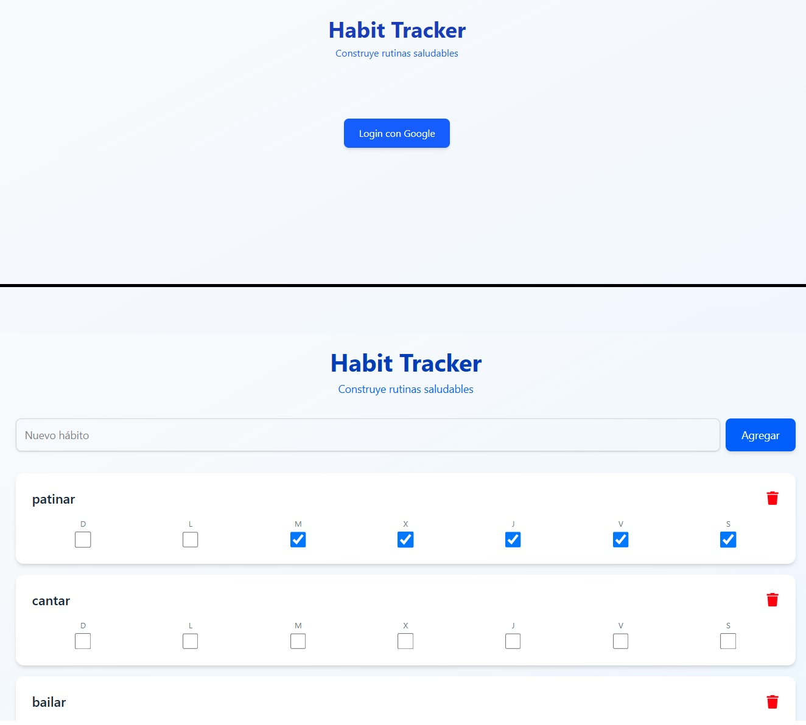

📋 Habit Tracker - Gestor de Hábitos

  

🚀 Tecnologías Utilizadas
Frontend: React + TypeScript + Vite

Estilos: Tailwind CSS

Backend: Firebase (Authentication + Firestore)

Deploy: Vercel

✨ Funcionalidades Principales
🔐 Autenticación Segura

Login/logout con Google mediante Firebase Auth

Datos protegidos por usuario

Persistencia de sesión

📝 Gestión de Hábitos
CRUD completo de hábitos

Checkboxes interactivos para marcar completados

📊 Estadísticas Visuales
Progreso semanal visible

Conteo de hábitos completados

Diseño responsive para móvil/desktop

🛠 Instalación Local
Clona el repositorio:

bash
git clone https://github.com/yanyo0/habit_tracker.git

cd habit_tracker

🔗 Enlaces

 [Ver Habit Tracker App](https://habit-tracker-amber-two.vercel.app/)